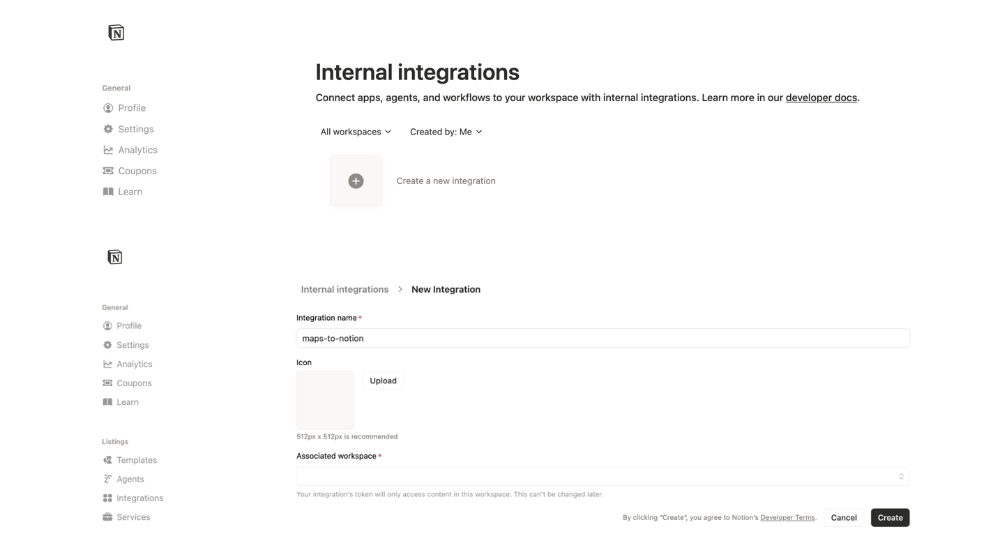
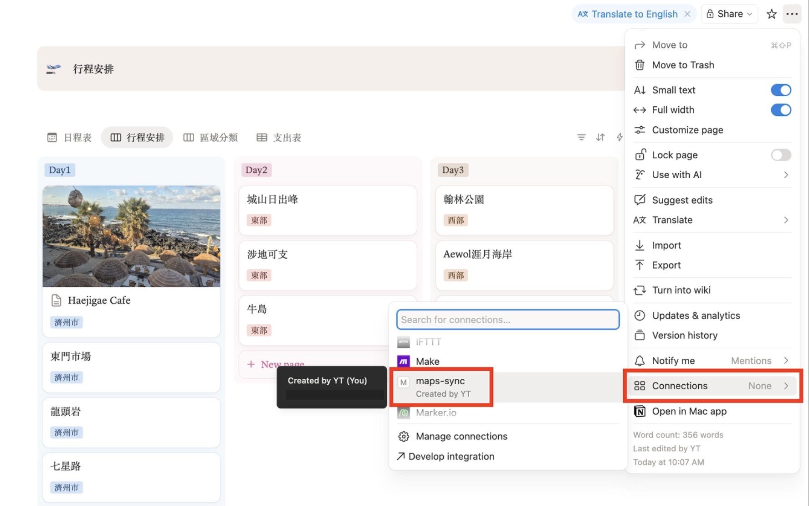
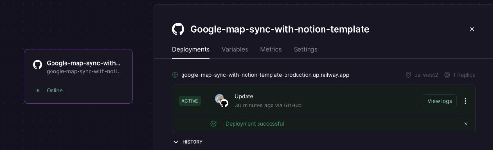

# Google Maps save to Notion Pages

將 Google Maps 分享連結轉成可寫入 Notion 的景點資料。

此專案提供一個以 `FastAPI` 實作的服務，會自動完成以下流程：

1. 展開 Google Maps 短網址。
2. 解析景點名稱與座標。
3. 優先用 Google Places API 補齊地址、評分、照片與評論。
4. 必要時用 OpenStreetMap 反查地址。
5. 使用 Google Places API reviews 作為評論來源。
6. 使用 Azure OpenAI 將評論整理成繁體中文摘要。
7. 搜尋相關介紹文章。
8. 將資料寫入 Notion Database 或指定頁面底下。

## 功能特色

- 支援 `Google Maps` 分享網址解析
- 支援 `Notion` Database 與 Page 兩種寫入模式
- 自動依地址判斷區域與行程天數
- 支援 Google Places 圖片與評分同步
- 支援 Places API 評論摘要整理
- 支援文章搜尋補充參考資料
- 提供預覽 API，寫入前可先檢查資料

## Tech Stack

- Python 3.10+
- FastAPI
- Uvicorn
- httpx
- notion-client
- python-dotenv

## 前置準備

在本機啟動或部署這個專案前，請先準備以下 2 組外部服務憑證：

1. `Google Places API Key`
2. `Notion Token` 與 `NOTION_DATABASE_ID`

### 1. 取得 Google Places API Key

此專案會使用 Google Places API 查詢景點名稱、地址、評分、照片與評論，因此必須先建立一組可用的 API Key。

操作步驟如下：

1. 前往 [console.cloud.google.com](https://console.cloud.google.com/)
2. 建立新專案（隨便命名，例如 `maps-to-notion`）
3. 左側選單 -> **API 和服務** -> **程式庫**
4. 搜尋 `Places API` -> 啟用
5. 左側 -> **憑證** -> **建立憑證** -> **API 金鑰**

建議補充設定：

- 到 API Key 的限制頁面，設定可使用的 API 範圍，避免金鑰被濫用。
- 若之後要部署到雲端，也建議限制 HTTP referrer、IP 或應用程式來源。
- 若 API 尚未啟用計費，Google Cloud 可能會拒絕部分 Places 功能。

最後請把金鑰填到 `.env`：

```env
GOOGLE_PLACES_API_KEY=你的_google_places_api_key
```

### 2. 取得 Notion Token 和 Database ID

此專案會把整理好的景點資料寫入 Notion，因此需要：

- 一組 `Notion Integration Token`
- 一個目標頁面的 `Database ID` 或 `Page ID`

#### 2-1. 建立 Notion Integration 並取得 Token

1. 打開 Notion integrations 頁面：[Notion Integrations](https://www.notion.so/profile/integrations/internal)
2. 點擊 `New integration`。
3. 輸入 integration 名稱，例如 `maps-to-notion`。
4. 選擇你要使用的 workspace。
5. 建立完成後，複製 `Internal Integration Token`。

請把它填到 `.env`：

```env
NOTION_TOKEN=你的_notion_integration_token
```


#### 2-2. 將 Integration 授權給目標頁面或資料庫

只建立 integration 還不夠，還要把它分享到你真正要寫入的 Notion 頁面或資料庫。

操作方式：

1. 打開你要寫入的 Notion Database，或該 Database 所在的父頁面。
2. 點右上角 `．．．`。
3. 在`connection`中搜尋你剛建立的 integration 名稱。
4. 將它加入，讓這個 integration 有權限讀寫該頁面或資料庫。

如果沒有做這一步，程式即使有 `NOTION_TOKEN`，也會因為沒有權限而無法寫入。



#### 2-3. 取得 Database ID 或 Page ID

這個專案的 `NOTION_DATABASE_ID` 可以填：

- Notion Database 的 ID
- 或一個 Notion Page 的 ID

兩種模式差異如下：

- 如果填的是 `Database ID`，程式會建立一筆資料列。
- 如果填的是 `Page ID`，程式會在該頁底下建立子頁。

取得方式：

1. 打開目標 Database 或 Page。
2. 從瀏覽器網址列複製該頁網址。
3. 找出網址最後那段長字串 ID。

常見格式範例：

```text
https://www.notion.so/workspace/Trip-Plan-1234567890abcdef1234567890abcdef
```

上面最後的：

```text
1234567890abcdef1234567890abcdef
```

就是你要填入的頁面或資料庫 ID。

請把它填到 `.env`：

```env
NOTION_DATABASE_ID=你的_notion_database_id_或_page_id
```

#### 2-4. 可選設定：指定要寫入的 Data Source 名稱

如果你的 Notion Database 下面有多個 data source，或你想指定特定名稱的目標資料來源，可以額外設定：

```env
NOTION_TARGET_NAME=行程安排
```

這個值預設就是 `行程安排`，通常不改也可以；只有當你的 Notion 結構名稱不同時，才需要手動調整。

### 3. 建議先完成 `.env` 設定

你可以先複製範例檔，再把上面取得的值填入：

```bash
cp .env.example .env
```

至少要先填好：

```env
GOOGLE_PLACES_API_KEY=...
NOTION_TOKEN=...
NOTION_DATABASE_ID=...
```

## 專案結構

```text
.
├── .dockerignore
├── app/
│   ├── config.py
│   ├── main.py
│   ├── schemas/
│   ├── services/
│   └── utils/
├── main.py
├── Dockerfile
├── images/
├── requirements.txt
├── Procfile
├── .env
└── .env.example
```

## 檔案與資料夾作用

- `main.py`: 專案最外層的啟動入口。這個檔案本身不放商業邏輯，主要是保留給 `uvicorn main:app`、`Procfile` 與部署平台直接啟動 API 使用。
- `app/main.py`: FastAPI 的主要 route 定義所在。這裡負責接收 `/save`、`/save-preview` 等請求，呼叫各個 service，最後組成 API 回傳格式。
- `app/config.py`: 集中管理環境變數、常數與共用 client，例如 `GOOGLE_PLACES_API_KEY`、`AZURE_OPENAI_ENDPOINT`、`NOTION_TOKEN`、`HTTP_TIMEOUT` 與 Notion client，避免分散在各個檔案裡。
- `app/schemas/requests.py`: 定義 API 請求資料格式。目前主要用來描述 `SaveRequest`，也就是 API 需要接收一個 `url` 字串欄位。
- `app/services/maps.py`: 處理 Google Maps 分享連結相關邏輯，例如展開短網址、清理分享參數、解析店名與座標，並將網址轉成後續 service 可使用的地點資訊。
- `app/services/places.py`: 專門和 Google Places API 溝通。負責查詢地點資料、取得照片、地址、評論與經緯度，若 Places API 查不到資料，也會退回座標反查地址。
- `app/services/reviews.py`: 處理評論摘要流程。會先整理 Places API 回來的 reviews，再送到 Azure OpenAI 產生繁體中文摘要，同時處理 fallback、錯誤訊息與摘要格式統一。
- `app/services/articles.py`: 負責搜尋景點相關文章，整理外部搜尋結果，讓回傳或 Notion 頁面可以附帶參考連結。
- `app/services/notion.py`: 專門處理 Notion 寫入邏輯。包含欄位對應、頁面內容 block 組裝、資料庫 schema 判斷，以及實際建立 Notion page 或 database row。
- `app/utils/region.py`: 放與地區判斷有關的純工具函式，例如把地址對應到 `濟州市`、`西部`、`西歸浦`、`東部`，以及依區域推算 `Day1~Day4` 與評分星等文字。
- `Dockerfile`: Railway 容器部署設定。定義部署時使用的 Python 基底映像、依賴安裝方式與容器啟動指令。
- `Procfile`: 提供給支援 Procfile 的雲端平台使用的啟動指令，告訴平台要如何啟動這個 FastAPI 服務。
- `requirements.txt`: Python 套件依賴清單。
- `.env.example`: 環境變數範例。
- `images/`: README 使用的示意圖片。

## Notion 寫入邏輯

程式會優先搜尋可存取的 Notion data source：

- 若找到名稱符合 `NOTION_TARGET_NAME` 的 data source，會直接寫入對應資料庫
- 若找不到但只找到一個可用 data source，會自動使用
- 若 `NOTION_DATABASE_ID` 是 Database，會建立資料列
- 若 `NOTION_DATABASE_ID` 是 Page，會改為建立子頁

目前會嘗試對應下列欄位：

- `Name` 或資料庫中的 title 欄位
- `分類`
- `日程`
- `Google Map`
- `評分`
- `經度(lng)`
- `緯度(lat)`

## 環境變數

請先複製範例檔：

```bash
cp .env.example .env
```

必要變數：

- `GOOGLE_PLACES_API_KEY`: Google Places API 金鑰
- `NOTION_TOKEN`: Notion Integration Token
- `NOTION_DATABASE_ID`: Notion Database ID 或 Page ID

可選變數：

- `NOTION_TARGET_NAME`: 指定要寫入的 Notion data source 名稱，預設為 `行程安排`
- `PORT`: 本機或部署時使用的連接埠，預設 `3000`
- `AZURE_OPENAI_ENDPOINT`: Azure OpenAI Chat Completions Endpoint
- `AZURE_OPENAI_API_KEY`: Azure OpenAI API Key

## 本機啟動

建議先建立虛擬環境：

```bash
python3 -m venv venv
source venv/bin/activate
pip install -r requirements.txt
uvicorn main:app --reload --port 3000
```

啟動後可用以下網址確認服務狀態：

```bash
curl http://127.0.0.1:3000/
```

預期回傳：

```json
{"status":"ok"}
```

## 本機 API 測試

### `GET /`

健康檢查。

### `POST /save-preview`

先解析 Google Maps 連結並回傳預覽資料，不寫入 Notion。

請求範例：

```bash
curl -X POST http://127.0.0.1:3000/save-preview \
  -H "Content-Type: application/json" \
  -d '{
    "url": "https://maps.app.goo.gl/your-share-link"
  }'
```

### `POST /save`

解析 Google Maps 連結後，直接寫入 Notion。

請求範例：

```bash
curl -X POST http://127.0.0.1:3000/save \
  -H "Content-Type: application/json" \
  -d '{
    "url": "https://maps.app.goo.gl/your-share-link"
  }'
```

### `GET /save-preview-link`

讓手機、捷徑或瀏覽器可直接用 query string 呼叫預覽 API。

請求範例：

```bash
curl "http://127.0.0.1:3000/save-preview-link?url=https%3A%2F%2Fmaps.app.goo.gl%2Fyour-share-link"
```

### `GET /save-link`

讓手機、捷徑或瀏覽器可直接用 query string 觸發寫入 Notion。

請求範例：

```bash
curl "http://127.0.0.1:3000/save-link?url=https%3A%2F%2Fmaps.app.goo.gl%2Fyour-share-link"
```

## Railway 部署

專案已包含 `Dockerfile`，Railway 可直接使用容器部署。

### 1. 建立專案

將此專案推到 GitHub 後，到 Railway 建立新專案並選擇該 repository：

`https://railway.com/new`

### 2. 設定環境變數

在 Railway 專案的 Variables 設定以下值：

- `GOOGLE_PLACES_API_KEY`
- `NOTION_TOKEN`
- `NOTION_DATABASE_ID`
- `NOTION_TARGET_NAME`
- `AZURE_OPENAI_ENDPOINT`
- `AZURE_OPENAI_API_KEY`

### 3. 部署

Railway 偵測到 `Dockerfile` 後會自動建置並啟動服務。

部署成功後，可先用以下網址確認：

```bash
curl https://your-app.up.railway.app/
```

預期回傳：

```json
{"status":"ok"}
```

## 正式 API 使用 - 手機 / 電腦

### 電腦

桌面端呼叫方式不變，只要把 `http://127.0.0.1:3000` 改成 Railway 提供的網域：

```bash
curl -X POST https://your-app.up.railway.app/save \
  -H "Content-Type: application/json" \
  -d '{
    "url": "https://maps.app.goo.gl/your-share-link"
  }'
```

### iPhone

最方便的方式是用「捷徑」接 Google Maps 分享連結，將收到的網址做 URL Encode 後，直接打開。

後端會自動清理 iPhone Google Maps 分享常見的追蹤參數，例如 `?g_st=ic`，也會兼容部分不是 `/maps/place/...` 的 Google Maps 展開格式，因此捷徑不需要額外做字串替換：

```text
https://your-app.up.railway.app/save-link?url=<URL_ENCODED_GOOGLE_MAPS_LINK>
```

例如：

```text
https://your-app.up.railway.app/save-link?url=https%3A%2F%2Fmaps.app.goo.gl%2Fabc123
```

如果你只想先看預覽，不直接寫入 Notion，可改用：

```text
https://your-app.up.railway.app/save-preview-link?url=https%3A%2F%2Fmaps.app.goo.gl%2Fabc123
```

#### iPhone 快捷指令設定

如果你希望送出後留在捷徑內顯示結果、不跳到 Safari，可依下列流程設定：

1. 新增捷徑，點畫面下面中間 `i`，開啟「在分享表單中顯示」。
2. 在「接受的內容」只勾選 `URL`。
3. 加入 `從輸入取得 URL` 動作，接收 Google Maps 分享連結。
4. 加入 `URL 編碼` 動作，輸入選上一步的 `URL`。
5. 可選：加入 `取代文字` 動作，使用常規表示式將 `\?g_st=.*` 取代成空字串。
6. 加入 `文字` 動作，內容填入：

```text
https://your-app.up.railway.app/save-link?url=[更新的文字]
```

如果你不需要第 5 步，這裡也可以直接接 `[URL 編碼文字]`。

7. 加入 `取得網址內容` 動作，輸入選上一步的 `文字`。
8. 加入 `顯示` 或 `快速查看` 動作，顯示上一步回傳內容。

完成後，在 Google Maps 按 `分享`，選擇這個捷徑即可直接看到 API 回傳結果。

如果你想先檢查資料、不直接寫入 Notion，將第 6 步改成：

```text
https://your-app.up.railway.app/save-preview-link?url=[更新的文字]
```



## 疑難排解

### 如何快速判斷 Places API 是否正常

先看 `/save-preview` 回傳裡的 `data_source`：

- `google_places_new`
  - 代表 Google Places API 有成功查到地點資料。
  - 如果這時 `review_count = 0`，問題通常比較偏向 `reviews` 欄位沒有回來，或本機與 Railway 的 Places API 回應內容不同。

- `fallback_reverse_geocode`
  - 代表 Google Places API 沒有成功查到完整地點資料，程式已退回座標反查地址。
  - 這種情況通常優先檢查 Railway 的 `GOOGLE_PLACES_API_KEY`、Places API 是否已啟用、Billing 是否正常，以及是否有 API restrictions 導致雲端環境無法使用。

### 如何快速判斷評論摘要卡在哪一層

再看 `review_source` 與 `review_error`：

- `google_places_reviews/azure_openai`
  - 代表 Places API reviews 與 Azure OpenAI 摘要都成功。

- `google_places_reviews/azure_fallback_http_error`
  - 代表 Places API reviews 有拿到，但 Railway 呼叫 Azure OpenAI 時發生 HTTP 錯誤。
  - 請檢查 `AZURE_OPENAI_ENDPOINT`、`AZURE_OPENAI_API_KEY`、deployment 名稱與 `api-version` 是否正確。

- `no_reviews_available`
  - 代表 Places API 沒有提供可用評論，因此沒有內容可送進 Azure OpenAI。

## 注意事項

- 評論摘要目前固定使用 Google Places API reviews，不再依賴瀏覽器自動化
- 若未設定 Azure OpenAI，系統會退回基本評論摘要
- `NOTION_TOKEN` 對應的 integration 必須已分享到目標 Notion 頁面或資料庫

## 後續建議

- 補上 `pytest` 測試，覆蓋 URL 解析、區域判斷與 Notion payload 組裝
- 將 `main.py` 拆分成 `services`、`clients`、`schemas`，降低單檔維護成本
